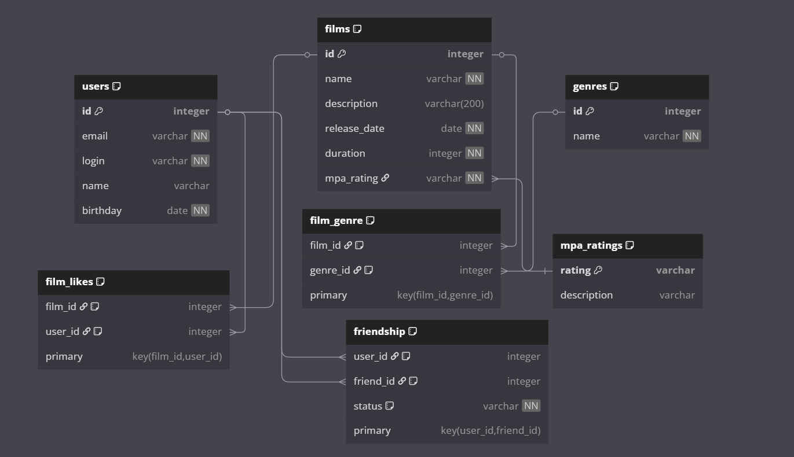

# java-filmorate
Template repository for Filmorate project.

## 📊 Схема базы данных


Полная схема базы данных Filmorate

### 🔍 Описание схемы:
Схема включает все необходимые таблицы для работы приложения:
- **Пользователи** (users) - информация о зарегистрированных пользователях
- **Фильмы** (films) - данные о фильмах в системе
- **Жанры** (genres) - категории фильмов (комедия, драма и т.д.)
- **Рейтинги MPA** (mpa_ratings) - возрастные ограничения
- **Лайки** (film_likes) - кто какие фильмы лайкнул
- **Дружба** (friendship) - связи между пользователями
- **Жанры фильмов** (film_genre) - связь фильмов с жанрами

## 🗃️ Структура таблиц

###  Основные таблицы

#### Таблица `users`
| Поле       | Тип        | Ограничения           | Описание          |
|------------|------------|-----------------------|-------------------|
| id         | INTEGER    | PRIMARY KEY, AUTO_INCREMENT | Уникальный ID пользователя(автоинкремент)|
| email      | VARCHAR    | NOT NULL, UNIQUE      | Электронная почта(уникальная) |
| login      | VARCHAR    | NOT NULL, UNIQUE      | Логин(уникальный) |
| name       | VARCHAR    |                       | Имя(может быть пустым, тогда используется login)|
| birthday   | DATE       | NOT NULL              | Дата рождения     |

#### Таблица `films`
| Поле          | Тип        | Ограничения           | Описание                            |
|---------------|------------|-----------------------|-------------------------------------|
| id            | INTEGER    | PRIMARY KEY, AUTO_INCREMENT | Уникальный ID фильма(автоинкремент) |
| name          | VARCHAR    | NOT NULL              | Название фильма                     |
| description   | VARCHAR(200)|                      | Описание (макс. 200 символов)       |
| release_date  | DATE       | NOT NULL              | Дата выхода(не может быть пустым)   |
| duration      | INTEGER    | NOT NULL              | Продолжительность (мин),(не может быть пустым)|
| mpa_rating    | VARCHAR    | NOT NULL              | Возрастной рейтинг(не может быть пустым)      |


#### Таблица `genres`
| Поле          | Тип     | Ограничения      | Описание                            |
|---------------|---------|------------------|-------------------------------------|
| id            | INTEGER | PRIMARY KEY      | ID жанра |
| name          | VARCHAR | NOT NULL, UNIQUE | Название жанра(не может быть пустым)|

#### Таблица `film_genre`
| Поле             | Тип     | Ограничения           | Описание  |
|------------------|---------|-----------------------|-----------|
| film_id          | INTEGER | PRIMARY KEY, FOREIGN KEY REFERENCES films(id) | ID фильма |
| genre_id         | INTEGER | PRIMARY KEY, FOREIGN KEY REFERENCES genres(id)| ID жанра  |


#### Таблица `mpa_ratings`
| Поле  | Тип       | Ограничения | Описание                   |
|-------|-----------|-------------|----------------------------|
| rating      | VARCHAR   | PRIMARY KEY | Код рейтинга (G, PG и т.д.)|
| description | VARCHAR   | NOT NULL    | Описание ограничения       |


**G — у фильма нет возрастных ограничений**

**PG — детям рекомендуется смотреть фильм с родителями**

**PG-13 — детям до 13 лет просмотр не желателен**

**R — лицам до 17 лет просматривать фильм можно только в присутствии взрослого**

**NC-17 — лицам до 18 лет просмотр запрещён**


#### Таблица `friendship`
| Поле  | Тип    | Ограничения   | Описание             |
|-------|--------|---------------|----------------------|
| user_id | INTEGER | PRIMARY KEY, FOREIGN KEY REFERENCES users(id) | Уникальный ID пользователя |
| friend_id | INTEGER | PRIMARY KEY, FOREIGN KEY REFERENCES users(id) | Уникальный ID друга  |
| status | VARCHAR| NOT NULL, DEFAULT 'unconfirmed' | Статус (unconfirmed/confirmed) |


#### Таблица `film_likes`
| Поле   | Тип        | Ограничения           | Описание                   |
|--------|------------|-----------------------|----------------------------|
| film_id       | INTEGER    | PRIMARY KEY, FOREIGN KEY REFERENCES films(id) | Уникальный ID фильма |
| user_id       | INTEGER    | PRIMARY KEY, FOREIGN KEY REFERENCES users(id) | Уникальный ID пользователя |

## 💾 Полные SQL-скрипты

### 🛠 Создание и наполнение таблиц


### ** Создание таблицы пользователей **
```sql
CREATE TABLE IF NOT EXISTS users (
    id INTEGER GENERATED BY DEFAULT AS IDENTITY PRIMARY KEY,
    email VARCHAR(255) NOT NULL UNIQUE,
    login VARCHAR(50) NOT NULL UNIQUE,
    name VARCHAR(100),
    birthday DATE NOT NULL,
    CONSTRAINT chk_login_no_spaces CHECK (login NOT LIKE '% %')
);
```

### ** Создание таблицы рейтингов MPA(mpa_ratings) **
```sql
CREATE TABLE IF NOT EXISTS mpa_ratings (
    id INTEGER GENERATED BY DEFAULT AS IDENTITY PRIMARY KEY,
    code VARCHAR(5) NOT NULL UNIQUE,
    name VARCHAR(50) NOT NULL,
    description VARCHAR(200) NOT NULL
);
```


### ** Наполнение рейтингов MPA **
```sql
INSERT INTO mpa_ratings (rating, description)
VALUES 
    ('G', 'Нет возрастных ограничений'),
    ('PG', 'Рекомендуется присутствие родителей'),
    ('PG-13', 'Детям до 13 лет просмотр не желателен'),
    ('R', 'Лицам до 17 лет с родителями'),
    ('NC-17', 'Лицам до 18 лет просмотр запрещён')
ON CONFLICT DO NOTHING;
```

### ** Создание таблицы фильмов (с ссылкой на id рейтинга) **
```sql
CREATE TABLE IF NOT EXISTS films (
    id INTEGER GENERATED BY DEFAULT AS IDENTITY PRIMARY KEY,
    name VARCHAR(100) NOT NULL,
    description VARCHAR(200),
    release_date DATE NOT NULL,
    duration INTEGER NOT NULL,
    mpa_id INTEGER NOT NULL REFERENCES mpa_ratings(id) ON UPDATE CASCADE,
    CONSTRAINT chk_release_date CHECK (release_date >= '1895-12-28'),
    CONSTRAINT chk_duration_positive CHECK (duration > 0)
);
```

### ** Создание таблицы жанров **
```sql
CREATE TABLE IF NOT EXISTS genres (
    id INTEGER PRIMARY KEY,
    name VARCHAR(50) NOT NULL UNIQUE
);
```

### ** Наполнение жанров **
```sql
INSERT INTO genres (id, name)
VALUES 
    (1, 'Комедия'),
    (2, 'Драма'),
    (3, 'Мультфильм'),
    (4, 'Триллер'),
    (5, 'Документальный'),
    (6, 'Боевик')
ON CONFLICT DO NOTHING;
```

### ** Таблица связи фильмов и жанров **
```sql
CREATE TABLE IF NOT EXISTS film_genre (
    film_id INTEGER REFERENCES films(id) ON DELETE CASCADE,
    genre_id INTEGER REFERENCES genres(id) ON DELETE CASCADE,
    PRIMARY KEY (film_id, genre_id)
);
```

### ** Таблица дружбы **
```sql
CREATE TABLE IF NOT EXISTS friendship (
    user_id INTEGER REFERENCES users(id) ON DELETE CASCADE,
    friend_id INTEGER REFERENCES users(id) ON DELETE CASCADE,
    status VARCHAR(20) NOT NULL DEFAULT 'unconfirmed',
    PRIMARY KEY (user_id, friend_id),
    CONSTRAINT chk_not_self_friend CHECK (user_id <> friend_id)
);
```

### ** Таблица лайков **
```sql
CREATE TABLE IF NOT EXISTS film_likes (
    film_id INTEGER REFERENCES films(id) ON DELETE CASCADE,
    user_id INTEGER REFERENCES users(id) ON DELETE CASCADE,
    PRIMARY KEY (film_id, user_id)
);
```

## 💾 Примеры SQL-запросов

### 🎥 Операции с фильмами

### **Добавление нового фильма:**
```sql
INSERT INTO films (name, description, release_date, duration, mpa_rating)
VALUES ('Inception', 'A thief who steals corporate secrets', '2010-07-16', 148, 'PG-13');
```

### **Получение топ-5 популярных фильмов:**
```sql
SELECT f.*, COUNT(fl.user_id) AS likes_count
FROM films f
LEFT JOIN film_likes fl ON f.id = fl.film_id
GROUP BY f.id
ORDER BY likes_count DESC
LIMIT 5;
```

### **Получение жанров фильма:**
```sql
SELECT g.* 
FROM genres g
JOIN film_genre fg ON g.id = fg.genre_id
WHERE fg.film_id = 1;
```

### 👥 Операции с пользователями

### **Регистрация нового пользователя:**
```sql
INSERT INTO users (email, login, name, birthday)
VALUES ('user@example.com', 'user123', 'John Doe', '1990-01-01');
```

### **Добавление в друзья:**
```sql
INSERT INTO friendship (user_id, friend_id, status)
VALUES (1, 2, 'unconfirmed');
```
### **Обновление статуса дружбы:**
```sql
UPDATE friendship 
SET status = 'confirmed' 
WHERE user_id = 2 AND friend_id = 1;
```

### 🔍 Поисковые запросы

**Получение общих друзей:**
```sql
SELECT u.* 
FROM users u
JOIN friendship f1 ON u.id = f1.friend_id AND f1.user_id = 1 AND f1.status = 'confirmed'
JOIN friendship f2 ON u.id = f2.friend_id AND f2.user_id = 2 AND f2.status = 'confirmed';
```


